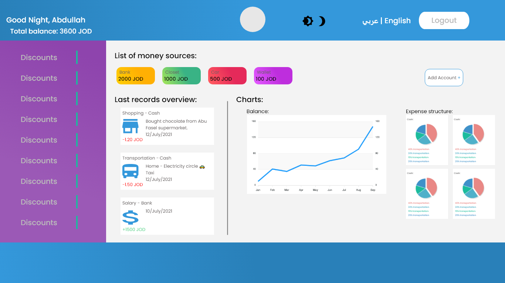

# beefyWallet

## Team Members

- Abdullah Al Sawalmeh.
- Abdelhadi Nofal.
- Amarah Ayman [Team leader].
- Ayman Naif.
- Ebrahim Ayyad.
  > [Team Agreement](Team%20Agreement.md)

## Description

To create web app for track user's money sources and it have a chart for help users to analyze their spending habits.

## Wireframes

## User Stories

1. As an admin , I want to have access to all API data
2. As a user, I want to signup in the web app , to have own account
3. As a user, I want to see a beautiful graphics
4. As a user, I want organized graphics to understand my transactions
5. As a user, I want to share my experience in this website
6. As a user, I want to add some ads or even see some of them
7. As a user, I want to draft my tracking money as pdf

## Software Requirements

[Requirements Documents](requirements.md)

## Domain Modeling

when the user enters the web page, he starts by logging into our website with the username and password. this will generate an access token for the user, after that all his data in the database will be returned and appear in tha main page

## Database Schema Diagram
